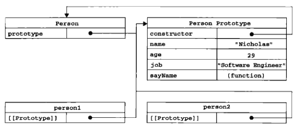

# 二、创建型设计模式
创建型设计模式是一类处理对象创建的设计模式
## 工厂模式
创建同一类对象，但无法解决对象识别的问题（即怎样知道一个对象的类型）

  
show me code

  <pre>
    <code>
      function createPerson(name, age, job) {
        let o = new Object()
        o.name = name
        o.age = age
        o.job = job
        o.sayHi = function() {
          console.log('hi')
        }
        return o
      }
      let person1 = createPerson('jerry', 26, 'software Engineer')
      let person2 = createPerson('zn', 28, 'Doctor')
    </code>
  </pre>

## 构造函数模式

  
show me code

  <pre>
    <code>
      function Person(name, age, job) {
        this.name = name
        this.age = age
        this.job = job
        this.sayHi = function() {
          console.log('hi')
        }
      }
      let person1 = new Person('jerry', 26, 'software Engineer')
      let person2 = new Person('zn', 28, 'Doctor')
    </code>
  </pre>

构造函数本身也是函数，只不过特殊在可用于创建对象。要创建对象需使用new操作符。new在这里做了四件事：
1. 创建一个新对象
2. 将构造函数的作用域赋值给新对象（因此this指向这个新对象）
3. 执行构造函数内的代码，为新对象添加属性和方法
4. 返回新对象

**[手动实现一个new]()** 

每个构造函数创建的对象实例，内部都有一个实例属性constructor，它指向对象实例的构造函数，因此可以通过instanceof操作符来检测对象的类型，这是胜过工厂模式的地方，可以将它的实例标识为一种特定的类型。

### 构造函数的应用
构造函数也是函数，当使用new操作符调用时用来创建对象，不通过new调用时和普通函数没什么两样。

  
show me code

  <pre>
    <code>
      // 作为构造函数使用
      let person1 = new Person('jerry', 26, 'software Engineer')
      person1.sayHi()
      // 作为普通函数使用
      Person('ally', 28, 'Engineer') // 添加到window对象
      window.sayHi()
      // 在另一个对象作用域内调用
      let o = new Object()
      Person.call(o, 'jerry', 26, 'software engineer')
      o.sayHi()
    </code>
  </pre>

### 构造函数的问题

构造函数中的每个方法，都会在每个实例上重新创建一次，会导致不同的作用域链和标识符解析，不同实例上的同名函数是不相等的。

        person1.sayHi === person2.sayHi // false

虽然可以在构造函数内调用外部方法，但在全局作用域中调用多个方法，封装性就不存在了。

好在，这个问题可以通过原型模式来解决。

## 原型模式
每个函数内部都有一个prototype属性，它是一个指针指向一个对象，这个对象包含了由特定类型的所有实例共享的属性和方法。使用原型对象，可以让所有实例共享它包含的属性和方法，这样就可以把构造函数的属性和方法都写在原型对象上。

  
show me code

  <pre>
    <code>
      function Person() {
      }
      Person.prototype.name = 'jerry'
      Person.prototype.age = 26
      Person.prototype.job = 'software engineer'
      Person.prototype.sayHi = function () {
        console.log('hi')
      }
      let person1 = new Person()
      let person2 = new Person()
      console.log(person1.sayHi === person2.sayHi) // true
    </code>
  </pre>

> 理解prototype、constructor和__proto__属性

只要是函数，内部都有一个prototype属性，它指向函数的原型对象。在prototype属性中都会有一个constructor构造函数属性，这个属性指向prototype属性所在的函数 `Person.prototype.constructor === Person` ，因此我们通过这个构造函数继续为原型对象添加其他属性和方法。而在调用构造函数创建了实例之后，该实例的内部将包含一个指针，指向构造函数的原型对象，`person1.__proto__ === Person.prototype` 这个指针存在于实例和构造函数的原型对象之间，而不是存在于实例和构造函数之间。

`Person.prototype.isPrototypeOf(person1) === true`

`Object.getPrototypeOf(person1) === Person.prototype` 

`Object.getPrototypeOf(person1).name  // jerry` 

> 读取对象的属性，识别属性的位置

当读取某一个对象的属性时，都会执行一次搜索。目标是具有给定名字的属性，首先搜索从对象实例本身开始，如果找到了给定名字的属性即返回该属性的值；如果没有找到则继续搜索指针指向的原型对象，在原型对象中查找具有给定名字的属性。

  
show me code

  <pre>
    <code>
      function Person() {
      }
      Person.prototype.name = 'jerry'
      Person.prototype.age = 26
      Person.prototype.job = 'software engineer'
      Person.prototype.sayHi = function () {
        console.log('hi')
      }
      let person1 = new Person()
      let person2 = new Person()
      person1.name = 'zyl'
      console.log(person1.name) // zyl
      console.log(person2.name) // jerry
      delete person1.name
      console.log(person1.name) // jerry
      console.log(person1.hasOwnPrototype("name")) // true name存在于实例person1中
      console.log(person2.hasOwnPrototype("name")) // false name存在于原型中
      console.log("name" in person1) // true name存在于原型中
      console.log("name" in person2) // true name存在于原型中
    </code>
  </pre>

使用 `hasOwnPrototype()` 方法可以检测一个属性是存在于对象实例中，还是存在于原型中。而 `in` 操作符只要是能够访问到的属性即返回true，不论该属性存在于对象实例中还是原型对象中。因此同时调用hasOwnPrototype()方法和in操作符，就可以确定属性是存在于对象中，还是存在于原型之中。

  
show me code

  <pre>
    <code>
      function hasPrototypeProperty(object, attr) {
        return (attr in object) && !object.hasOwnPrototype(attr)
      }
      // return true 为属性存在原型中
      // 当实例重写同名属性之后，hasPrototypeProperty()则会返回false 
    </code>
  </pre>

使用 `for-in` 循环时，返回的是所有能够通过对象访问到的，可枚举的属性，既包括存在于实例中的，又包括存在于原型中的属性。即使屏蔽了原型中不可枚举的属性，也会在for-in循环中返回，因为根据规定，所有开发人员定义的属性都是可枚举的。

使用 `Object.keys()` 方法接收一个对象，返回一个包含所有可枚举的字符串数组，取得对象实例上所有可枚举的属性

  
show me code

  <pre>
    <code>
      function Person() {
      }
      Person.prototype.name = 'jerry'
      Person.prototype.age = 26
      Person.prototype.job = 'software engineer'
      Person.prototype.sayHi = function () {
        console.log('hi')
      }
      let person1 = new Person()
      person1.name = 'ally'
      person1.age = 28
      console.log(Object.keys(Person.prototype)) // ['name', 'age', 'job', 'sayHi']
      console.log(Object.keys(person1)) // ['name', 'age']
    </code>
  </pre>

如果你想得到所有实例属性，无论它是否可枚举，都可以使用 `Object.getOwnPropertyNames()` 方法。它和 `Object.keys()` 方法都可以替代 `for-in` 循环。

  
show me code

  <pre>
    <code>
      console.log(Object.getOwnPropertyNames(Person.prototype)) // ['constructor', 'name', 'age', 'job', 'sayHi']
      // 注意这里输出了 constructor 属性 不可枚举
    </code>
  </pre>

更简单的原型写法，以字面量的形式给原型对象添加属性和方法。这样虽然结果是相同的，但是本质上是以字面量的形式创建了一个新对象赋值给原型对象。因此原型对象中的 `constructor` 属性就不指向 `Person` 对象了。 `instanceOf` 操作符还是会返回true但是 `constructor` 指的是 `Objec`t 而不是 `Person`。

  
show me code

  <pre>
    <code>
      Person.prototype = {
        name: 'zhao',
        age: 22
      }
      let frient = new Person()
      console.log(Person.prototype.constructor === Person) // false
      console.log(firent.constructor === Person) // false
    </code>
  </pre>

如果 `constructor` 很重要，可以手动指定。

  
show me code

  <pre>
    <code>
      Person.prototype = {
        constructor: Person, // 手动指定
        name: 'zhao',
        age: 22
      }
      console.log(Person.prototype.constructor === Person) // true
      console.log(Object.keys(Person.protoype)) // ["constructor", "name", "age"]
      let frient = new Person()
      console.log(firent.constructor === Person) // true
    </code>
  </pre>

默认情况下，原生的 `constructor` 属性是不可枚举的，我们手动重设属性是可枚举的。要改就改彻底，使用 `Object.defineProperty()` 修改属性的描述

  
show me code

  <pre>
    <code>
      Person.prototype = {
        name: 'zhao',
        age: 22
      }
      Object.defineProperty(Person.protoype, 'constructor', {
        enumerable: false,
        value: Person
      })
      console.log(Person.prototype.constructor === Person) // true
      console.log(Object.keys(Person.protoype)) // ["name", "age"]
      let frient = new Person()
      console.log(firent.constructor === Person) // true
    </code>
  </pre>

### 原型模式的问题
首先，它省略了为构造函数传递初始化参数的环节，结果所有的对象实例都拥有相同值的属性和方法，这会带来不便。然而最重要的问题是由其共享的本质带来的，函数共享非常合适，基本值属性也还行，起码可以在实例中重写覆盖，而对于引用类型的属性来说就很不合适了，毕竟每个实例都拥有属于自己的全部属性。如果初衷只是为实例共享一个数组，那没什么，如果实例拿到数组以后做些修改操作，那将会影响到其他实例的数据。

  
show me code

  <pre>
    <code>
      function Person() {}
      Person.prototype = {
        name: 'jerry',
        age: 26,
        friends: ['sam', 'mark'],
        sayHi: function() {
          console.log('hi')
        }
      }
      let person1 = new Person()
      person1.friends.push('ally')
      let person2 = new Person()
      console.log(person2.friends) // ['sam', 'mark', 'ally']
    </code>
  </pre>

## 组合使用构造函数模式和原型模式

在构造函数中的方法，在每一个实例中都要重新创建一次，使用原型模式添加方法可避免；原型模式下不能传入初始化参数，且对于共享引用类型的属性不太合适，这一部分则可以使用构造函数模式来避免。集两者模式之长，每个实例都会有自己的一份实例属性的副本，同时又可以共享者对方法的引用，最大限度的节省了内存。

  
show me code

  <pre>
    <code>
      function Person(name, age, friends) {
        // 使用构造函数来定义实例属性
        this.name = name
        this.age = age
        this.friends = ['sam', 'mark']
      }
      // 使用原型模式来定义方法和共享属性
      Person.prototype = {
        constructor: Person,
        job: 'software engineer',
        sayHi: function() {
          console.log('hi')
        }
      }
      let person1 = new Person('jerry', 26)
      person1.friends.push('ally')
      let person2 = new Person('ally', 28)
      console.log(person2.friends) // ['sam', 'mark']
    </code>
  </pre>

这种构造函数和原型混合的模式，是目前ECMAscript中使用最广泛，认可度最高的创建自定义类型的方法。此外还可以了解下 `动态原型模式`， 动态添加原型方法；`寄生构造函数模式`，封装创建对象的代码并返回新创建的对象，例如封装一个创建具有特殊方法的数组对象； `稳妥构造函数模式`，这些模式了解即可，实例与构造函数的原型对象之间没有关系，无法使用 `instanceOf` 操作符来确定其对象类型。